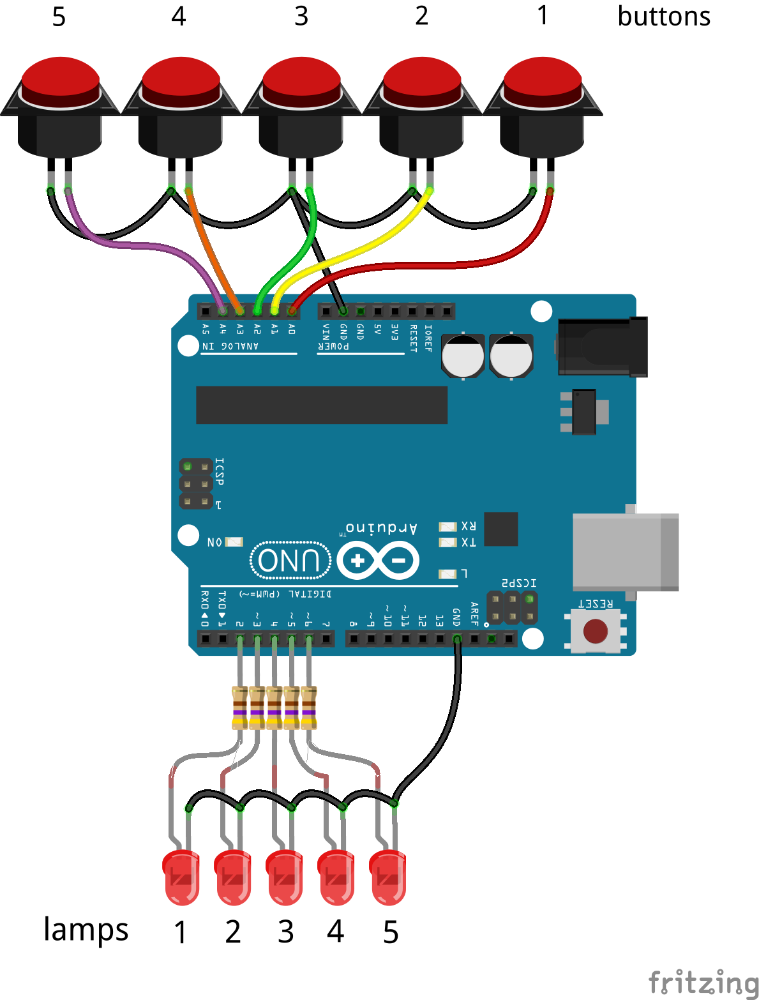
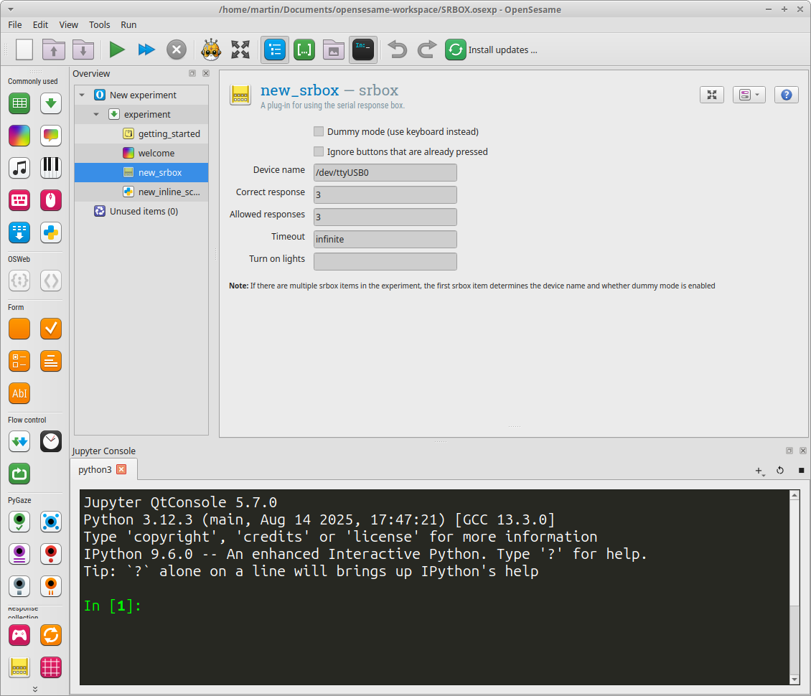
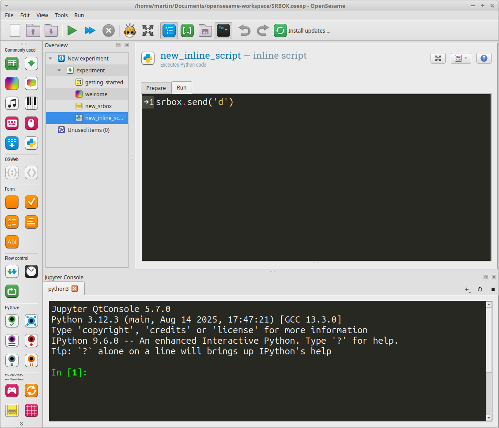

# The Arduino Serial Response Box

*This Arduino project emulates the famous 5-buttons / 5-lamps Serial Response Box model 200A from PST.*

## Introduction
The PST Serial Response Box (sr-box) is famous in psychology research and is often used with E-prime or OpenSesame. This open-source alternative with Arduino (UNO) is protocol and performance compatible with the PST model 200A sr-box, but it has no voice key functionality.

## Connecting buttons
With *arduino-srbox* it is possible to connect up to five switches with normally-open (NO) contacts to inputs A0 to A4. Each switch connects to GND and one input.

When using normally-closed (NC) contacts, please change the code en set `ncSwitch = true` (unused inputs must be tied to GND with NC).

## Connecting lamps
Use LED's with 330E to 1K series resistors on outputs 2-6. Please refer to the Arduino website on how to connect LED's to digital ports.
When using transistor logic at the lamp outputs, the logic levels can be inverted by setting `outputInvert = true` in the code.

## Wiring diagram

## Using the arduino-srbox with OpenSesame 4
For using the arduino-srbox in OpenSesame, drag the *srbox* plugin into the experiment. Use port: `/dev/ttyACMx`, `/dev/ttyUSBx` or `COMx` on Windows.

In OpenSesame 4.1 it seems not possible to control the lamps from the plugin panel by sending a character (e.g. 'a') or an integer number. To control the lamps, use the inline python block to execute: `srbox.send('d')`, for example here to turn on lamp 3.

## OpenSesame documentation about the *srbox* plugin
The OpenSesame srbox documentation can be found here:

[https://osdoc.cogsci.nl/4.1/manual/response/srbox/](https://osdoc.cogsci.nl/4.1/manual/response/srbox/)

